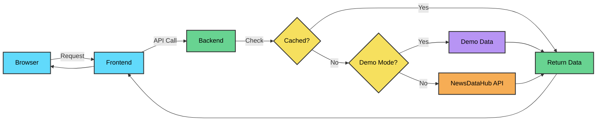

# News Aggregator Tutorial


[](LICENSE)


[](https://newsdatahub.com)

A modern, full-featured news aggregator application built to demonstrate the capabilities of the [NewsDataHub API](https://newsdatahub.com). This project serves as both a functional news reader and a comprehensive tutorial for developers learning to integrate news APIs into their applications.

## Overview

This news aggregator provides a clean, responsive interface for browsing and filtering news articles from thousands of sources worldwide. Built with React and TypeScript on the frontend and Express on the backend, it showcases best practices for API integration, caching strategies, and modern web development.

The application can run in two modes:
- **Demo Mode**: Explore the full functionality without an API key using pre-cached sample data
- **Live Mode**: Connect to the NewsDataHub API for real-time news from around the world

## Demo

Try the demo mode to explore the application without any setup:

```bash
git clone git@github.com:newsdatahub/newsdatahub-news-aggregator.git
cd newsdatahub-news-aggregator
docker compose up
```

Then visit `http://localhost` in your browser.

No API key required for demo mode.

## Features

**Comprehensive Filtering**
- Advanced search with AND, OR, NOT Boolean operators
- Multi-country selection with flag indicators
- Language filtering with native language names
- Political leaning filter (Far Left to Far Right)
- Date range selection with quick presets
- Topic-based filtering (Politics, Technology, Business, etc.)
- Source type filtering (Newspaper, Magazine, Digital Native, etc.)

**Modern UI/UX**
- Full dark mode support with theme persistence
- Fully responsive layout (mobile, tablet, desktop)
- Grid and list view options
- Skeleton loading states for better perceived performance
- Related articles expansion

**Performance Optimized**
- Smart caching strategy (1 hour for current news, 24 hours for historical)
- Efficient API usage designed for free tier constraints
- Lazy loading images
- Debounced search input
- Request deduplication

**Developer Friendly**
- Full TypeScript coverage
- Modular architecture
- Docker support for easy deployment

## How It Works



The application follows a simple flow:
1. User interacts with filters and search in the React frontend
2. Frontend sends requests to the Express backend API
3. Backend checks in-memory cache for existing data
4. If not cached, backend either loads demo data or calls NewsDataHub API
5. Response is cached and returned to frontend
6. Frontend renders articles with the received data

## Architecture

**Frontend (React + TypeScript)**
- Component-based architecture
- Custom hooks for data fetching and state management
- CSS variables for theming
- Vite for fast development and optimized builds

**Backend (Express + TypeScript)**
- RESTful API design
- In-memory caching with TTL (Time To Live)
- Demo data service for offline functionality
- Winston for structured logging
- CORS configuration for cross-origin requests

**Project Structure**
```
newsdatahub-news-aggregator/
├── backend/                    # Express backend
│   ├── src/
│   │   ├── config/            # Configuration files
│   │   ├── routes/            # API route handlers
│   │   ├── services/          # Business logic (API, cache, demo)
│   │   ├── types/             # TypeScript type definitions
│   │   ├── utils/             # Utility functions
│   │   └── server.ts          # Application entry point
│   ├── demo-data/             # Pre-cached demo data
│   └── package.json
├── frontend/                   # React frontend
│   ├── src/
│   │   ├── components/        # React components
│   │   │   └── filters/       # Filter components
│   │   ├── constants/         # Application constants
│   │   ├── hooks/             # Custom React hooks
│   │   ├── services/          # API client service
│   │   ├── types/             # TypeScript type definitions
│   │   ├── utils/             # Utility functions
│   │   ├── App.tsx            # Main application component
│   │   ├── main.tsx           # Application entry point
│   │   └── index.css          # Global styles
│   └── package.json
├── docker-compose.yml
├── .env.example
└── README.md
```

## Prerequisites

- Node.js 18+ (for local development)
- Docker and Docker Compose (for containerized deployment)
- NewsDataHub API key (optional - not required for demo mode)

## Quick Start

### Option 1: Docker (Recommended)

1. Clone the repository
   ```bash
   git clone git@github.com:newsdatahub/newsdatahub-news-aggregator.git
   cd newsdatahub-news-aggregator
   ```

2. Set up environment variables
   ```bash
   cp .env.example .env
   # Edit .env if you want to use your own API key
   # Or leave ENABLE_DEMO_MODE=true to run in demo mode
   ```

3. Start with Docker Compose
   ```bash
   docker compose up -d
   ```

4. Open your browser
   ```
   http://localhost
   ```

### Configuration

**Backend Environment Variables** (`.env` in `backend` directory)

```bash
# NewsDataHub API Configuration
NEWSDATAHUB_API_KEY=your_api_key_here

# Server Configuration
PORT=3001
NODE_ENV=development
ALLOWED_ORIGINS=http://localhost:5173

# Demo Mode (set to false to use real API)
ENABLE_DEMO_MODE=true
```

**Frontend Environment Variables** (`.env` in `frontend` directory)

```bash
# API Base URL (used in production)
VITE_API_BASE_URL=http://localhost:3001
```

### Getting a NewsDataHub API Key

1. Visit [newsdatahub.com](https://newsdatahub.com)
2. Sign up for a free account (no credit card required)
3. Navigate to your dashboard
4. Copy your API key
5. Add it to your backend `.env` file
6. Set `ENABLE_DEMO_MODE=false` to use live data

For current pricing, API quotas, and feature details, visit [newsdatahub.com](https://newsdatahub.com).

## Example Reports

### Health Check Endpoint

**Request:**
```bash
curl http://localhost:3001/api/health
```

**Response:**
```json
{
  "ok": true,
  "demo_mode": true,
  "api_configured": false
}
```

## FAQ

### What is the difference between Demo Mode and Live Mode?

**Demo Mode:**
- Uses pre-cached sample data stored locally
- No API key required
- All filtering and search features work normally
- Data is static and does not update
- Related articles displayed are example/dummy results (not necessarily actually related to the articles they appear under)
- Perfect for testing, development, or exploring the app

**Live Mode:**
- Connects to the NewsDataHub API for real-time data
- Requires a valid API key
- Returns current news articles based on your plan's constraints
- Data updates regularly as new articles are published
- Related articles are actually related to the main article
- Subject to API rate limits based on your subscription tier

### Do I need an API key to run the demo?

No, the demo mode works without an API key. Simply ensure `ENABLE_DEMO_MODE=true` is set in your backend `.env` file. This allows you to explore all features using pre-cached sample data.

### How do I switch from Demo Mode to Live Mode?

1. Get an API key from [newsdatahub.com](https://newsdatahub.com)
2. Add the key to your backend `.env` file: `NEWSDATAHUB_API_KEY=your_key_here`
3. Set `ENABLE_DEMO_MODE=false` in your backend `.env` file
4. Restart the backend server

### Why am I seeing a delay on some articles?

Depending on your NewsDataHub API subscription tier, there may be a time delay on when articles become available. Free tier users typically receive news from a few days ago, while paid tiers provide access to more recent or real-time news. Check [newsdatahub.com](https://newsdatahub.com) for current tier details.

### How does caching work?

The backend implements a smart caching strategy:
- **Current news** (last 2 days): Cached for 1 hour
- **Historical news**: Cached for 24 hours
- Caching reduces API calls and improves performance
- Cache is stored in-memory (cleared on server restart)

### Can I use this in production?

This is a demo/tutorial application designed for learning and local development. For production use, consider the following enhancements:

**Production Considerations:**
- Add HTTPS/SSL (use Let's Encrypt or Cloudflare)
- Set `NODE_ENV=production` in backend environment
- Update `ALLOWED_ORIGINS` to include your production domain
- Implement persistent caching with Redis instead of in-memory cache
- Set up monitoring and logging (PM2, Datadog, New Relic, etc.)
- Implement rate limiting for API protection
- Add authentication if making publicly accessible
- Use a process manager like PM2 for the backend
- Consider a CDN for frontend static assets
- Implement proper error tracking (Sentry, Rollbar, etc.)
- Add database storage for user preferences or saved articles
- Implement security hardening (helmet.js, input validation, etc.)

**Important:** This is a demo/tutorial application. For production use, consider adding proper authentication, database storage, and security hardening.

**Q: Where can I report bugs or ask questions?**

* GitHub → [Issues](https://github.com/newsdatahub/newsdatahub-news-aggregator/issues) or Discussions
* Email → [support@newsdatahub.com](mailto:support@newsdatahub.com)
* [NewsDataHub Docs](https://docs.newsdatahub.com)

### What are the supported search operators?

The search supports Boolean operators:
- **AND**: `climate AND change` - Both terms must appear
- **OR**: `tesla OR spacex` - Either term can appear
- **NOT**: `apple NOT fruit` - Exclude results containing "fruit"

You can combine operators: `(tesla OR spacex) AND musk NOT twitter`

## Contributing

Contributions are welcome! Please feel free to submit a Pull Request. Whether it's bug fixes, feature additions, documentation improvements, or examples, all contributions help make this tutorial better for everyone.

## License

MIT License - see LICENSE

## Resources

- [NewsDataHub API](https://newsdatahub.com)
- [NewsDataHub API Documentation](https://newsdatahub.com/docs)
- [Get Free API Key](https://newsdatahub.com/signup)

## Built With

- [React](https://react.dev/) - Frontend framework
- [TypeScript](https://www.typescriptlang.org/) - Type safety
- [Express](https://expressjs.com/) - Backend framework
- [Vite](https://vitejs.dev/) - Build tool
- [NewsDataHub API](https://newsdatahub.com) - News data provider
- [Lucide React](https://lucide.dev/) - Icons
- [React DatePicker](https://reactdatepicker.com/) - Date selection

---

Built to help developers integrate news APIs quickly and effectively.
