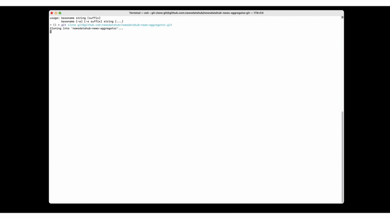
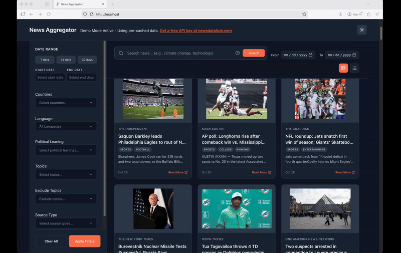
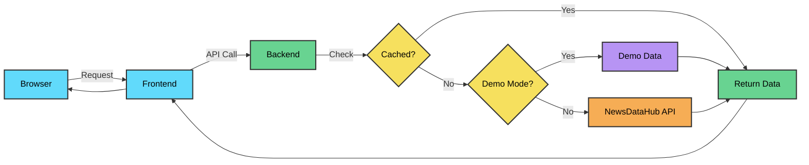
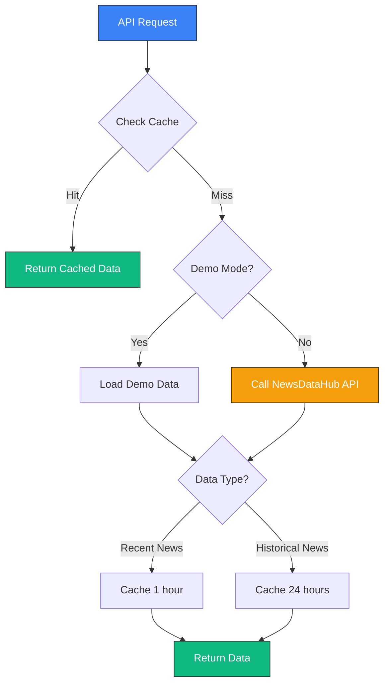
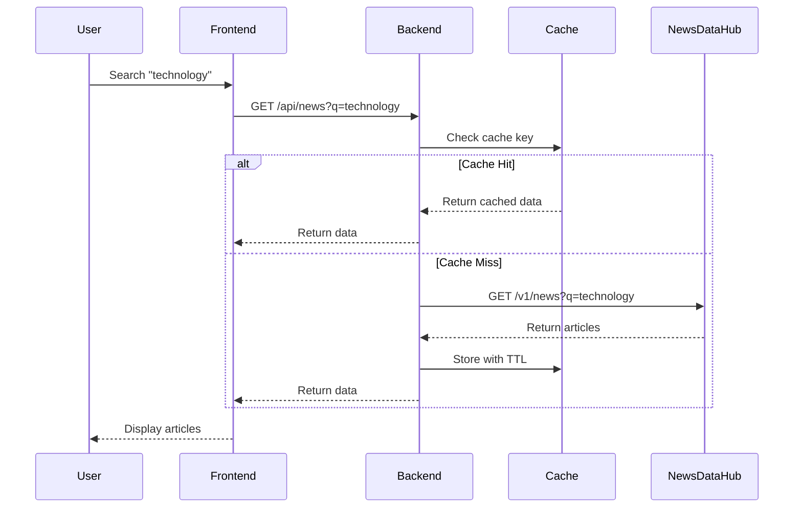
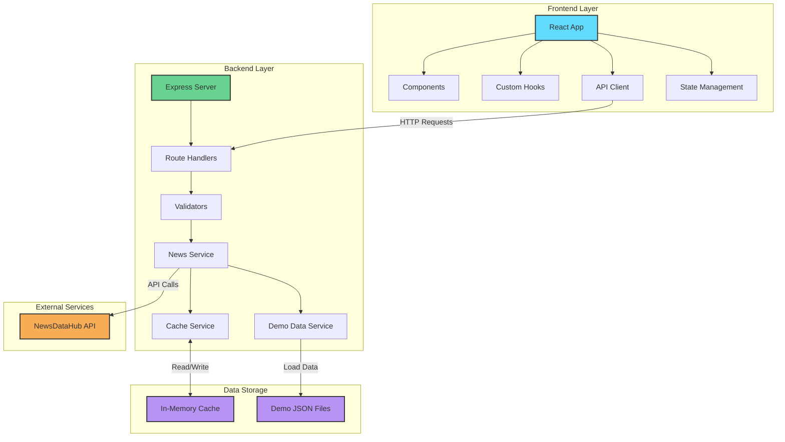
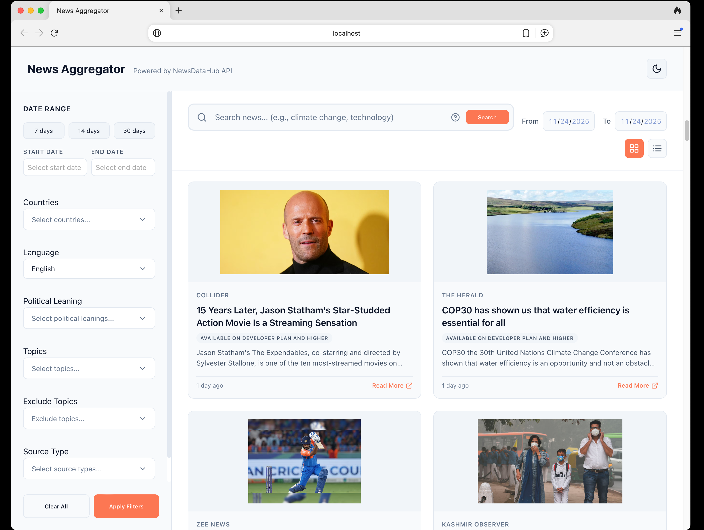
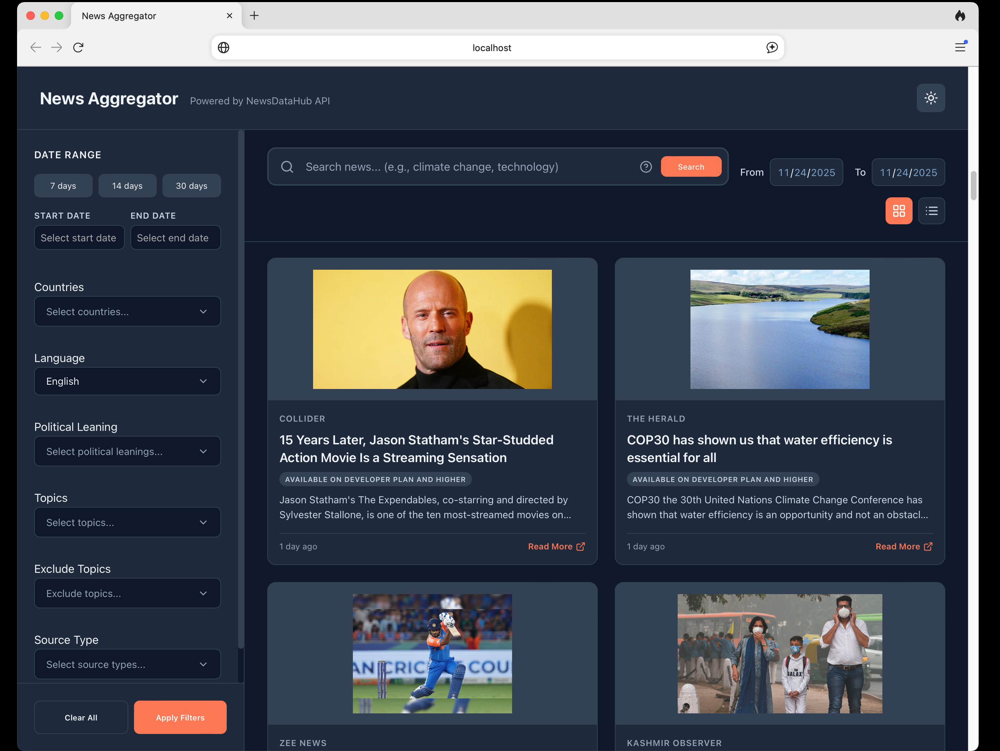
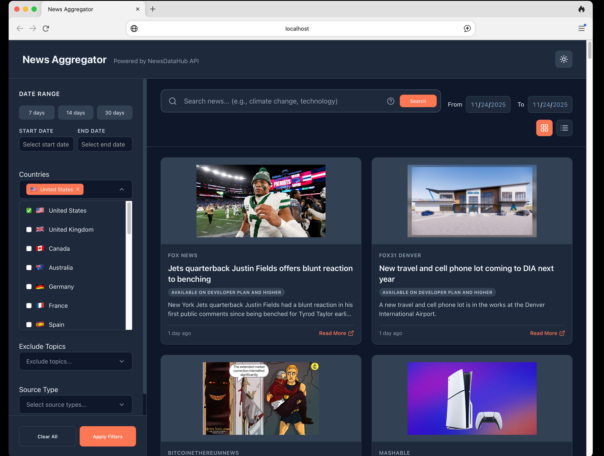

# News Aggregator Tutorial

[](LICENSE)


[](https://newsdatahub.com)

> 🎁 **Special Offer:** Deploy your news aggregator and get **50% off NewsDataHub API for 3 months**! [Learn more ↓](#special-offer-deploy--get-50-off)

A modern, full-featured news aggregator application built to demonstrate the capabilities of the [NewsDataHub API](https://newsdatahub.com). This project serves as both a functional news reader and a comprehensive tutorial for developers learning to integrate news APIs into their applications.

## Table of Contents

- [Get Started in 30 Seconds](#get-started-in-30-seconds)
- [What You'll Learn](#what-youll-learn)
- [Demo](#demo)
- [Features](#features)
- [How It Works](#how-it-works)
- [Architecture](#architecture)
- [Prerequisites](#prerequisites)
- [Quick Start](#quick-start)
- [Configuration](#configuration)
- [Screenshots](#screenshots)
- [Special Offer: Deploy & Get 50% Off](#special-offer-deploy--get-50-off)
- [FAQ](#faq)
- [Contributing](#contributing)
- [License](#license)
- [Resources](#resources)

## Get Started in 30 Seconds

Try the demo mode instantly - no API key required:

```bash
git clone https://github.com/newsdatahub/newsdatahub-news-aggregator.git
cd newsdatahub-news-aggregator
docker compose up
```

Then visit **http://localhost** in your browser. That's it!

## What You'll Learn

This tutorial teaches you real-world development concepts:

- ✅ **API Proxy Pattern** - Secure API key handling and backend architecture
- ✅ **Smart Caching** - Reduce API calls by 90% with dynamic TTL strategies
- ✅ **Testing Strategy** - Unit, integration, and E2E tests for production-ready code
- ✅ **Docker Deployment** - Package and deploy anywhere with containers
- ✅ **Boolean Search** - Powerful query building with AND/OR/NOT operators
- ✅ **Demo Mode Pattern** - Let users try before they buy
- ✅ **Full-Stack TypeScript** - Type-safe development from frontend to backend

Perfect for developers learning API integration, caching strategies, and modern full-stack development.

## Demo

### Getting Started


### Demo Mode


The application can run in two modes:
- **Demo Mode**: Explore the functionality without an API key using pre-cached sample data
- **Live Mode**: Connect to the NewsDataHub API for real-time news from around the world

## Features

### Comprehensive Filtering
- Advanced search with AND, OR, NOT Boolean operators
- Multi-country selection with flag indicators (170+ countries)
- Language filtering with native language names (40+ languages)
- Political leaning filter (Far Left to Far Right)
- Date range selection with quick presets
- Topic-based filtering (Politics, Technology, Business, etc.)
- Source type filtering (Newspaper, Magazine, Digital Native, etc.)

### Modern UI/UX
- Full dark mode support with theme persistence
- Fully responsive layout (mobile, tablet, desktop)
- Grid and list view options
- Skeleton loading states for better perceived performance
- Clean, intuitive interface

### Performance Optimized
- Smart caching strategy (1 hour for current news, 24 hours for historical)
- Efficient API usage designed for free tier constraints
- Lazy loading images
- Debounced search input
- Request deduplication

### Developer Friendly
- Full TypeScript coverage
- Modular architecture
- Comprehensive error handling
- Docker support for easy deployment
- Well-documented code

## How It Works

### Application Flow Diagram


```mermaid
graph LR
    A[Browser]:::blue -->|Request| B[Frontend]:::blue
    B -->|API Call| C[Backend]:::green
    C -->|Check| D{Cached?}:::yellow
    D -->|Yes| E[Return Data]:::green
    D -->|No| F{Demo Mode?}:::yellow
    F -->|Yes| G[Demo Data]:::purple
    F -->|No| H[NewsDataHub API]:::orange
    G --> E
    H --> E
    E --> B
    B --> A

    classDef blue fill:#61DAFB,stroke:#333,stroke-width:2px,color:#000
    classDef green fill:#68D391,stroke:#333,stroke-width:2px,color:#000
    classDef yellow fill:#F6E05E,stroke:#333,stroke-width:2px,color:#000
    classDef purple fill:#B794F4,stroke:#333,stroke-width:2px,color:#000
    classDef orange fill:#F6AD55,stroke:#333,stroke-width:2px,color:#000
```

### Cache Strategy Diagram


```mermaid
graph TD
    A[API Request] --> B{Check Cache}
    B -->|Hit| C[Return Cached Data]
    B -->|Miss| D{Demo Mode?}
    D -->|Yes| E[Load Demo Data]
    D -->|No| F[Call NewsDataHub API]
    E --> G{Data Type?}
    F --> G
    G -->|Recent News| H[Cache 1 hour]
    G -->|Historical News| I[Cache 24 hours]
    H --> J[Return Data]
    I --> J

    style A fill:#3b82f6,stroke:#333,color:#fff
    style C fill:#10b981,stroke:#333,color:#fff
    style J fill:#10b981,stroke:#333,color:#fff
    style F fill:#f59e0b,stroke:#333,color:#fff
```

### Proxy Sequence Diagram


```mermaid
sequenceDiagram
    participant User
    participant Frontend
    participant Backend
    participant Cache
    participant NewsDataHub

    User->>Frontend: Search "technology"
    Frontend->>Backend: GET /api/news?q=technology
    Backend->>Cache: Check cache key

    alt Cache Hit
        Cache-->>Backend: Return cached data
        Backend-->>Frontend: Return data
    else Cache Miss
        Backend->>NewsDataHub: GET /v1/news?q=technology
        NewsDataHub-->>Backend: Return articles
        Backend->>Cache: Store with TTL
        Backend-->>Frontend: Return data
    end

    Frontend-->>User: Display articles
```

The application follows this flow:
1. User interacts with filters and search in the React frontend
2. Frontend sends requests to the Express backend API
3. Backend checks in-memory cache for existing data
4. If not cached, backend either loads demo data or calls NewsDataHub API
5. Response is cached with smart TTL and returned to frontend
6. Frontend renders articles with the received data

## Architecture

### System Architecture Diagram


```mermaid
graph TB
    subgraph "Frontend Layer"
        A[React App]
        A1[Components]
        A2[Custom Hooks]
        A3[API Client]
        A4[State Management]
        A --> A1
        A --> A2
        A --> A3
        A --> A4
    end

    subgraph "Backend Layer"
        B[Express Server]
        B1[Route Handlers]
        B2[Validators]
        B3[News Service]
        B4[Cache Service]
        B5[Demo Data Service]
        B --> B1
        B1 --> B2
        B2 --> B3
        B3 --> B4
        B3 --> B5
    end

    subgraph "External Services"
        C[NewsDataHub API]
    end

    subgraph "Data Storage"
        D[In-Memory Cache]
        E[Demo JSON Files]
    end

    A3 -->|HTTP Requests| B1
    B3 -->|API Calls| C
    B4 <-->|Read/Write| D
    B5 -->|Load Data| E

    style A fill:#61DAFB,stroke:#333,stroke-width:2px
    style B fill:#68D391,stroke:#333,stroke-width:2px
    style C fill:#F6AD55,stroke:#333,stroke-width:2px
    style D fill:#B794F4,stroke:#333,stroke-width:2px
    style E fill:#B794F4,stroke:#333,stroke-width:2px
```

**Frontend (React + TypeScript)**
- Component-based architecture
- Custom hooks for data fetching and state management
- CSS variables for theming
- Vite for fast development and optimized builds

**Backend (Express + TypeScript)**
- RESTful API design
- In-memory caching with TTL (Time To Live)
- Demo data service for offline functionality
- Winston for structured logging
- CORS configuration for cross-origin requests

**Project Structure**
```
newsdatahub-news-aggregator/
├── backend/                    # Express backend
│   ├── src/
│   │   ├── config/            # Configuration files
│   │   ├── routes/            # API route handlers
│   │   ├── services/          # Business logic (API, cache, demo)
│   │   ├── types/             # TypeScript type definitions
│   │   ├── utils/             # Utility functions
│   │   └── server.ts          # Application entry point
│   ├── demo-data/             # Pre-cached demo data
│   ├── .env.example           # Environment variables template
│   └── package.json
├── frontend/                   # React frontend
│   ├── src/
│   │   ├── components/        # React components
│   │   │   └── filters/       # Filter components
│   │   ├── constants/         # Application constants
│   │   ├── hooks/             # Custom React hooks
│   │   ├── services/          # API client service
│   │   ├── types/             # TypeScript type definitions
│   │   ├── utils/             # Utility functions
│   │   ├── App.tsx            # Main application component
│   │   ├── main.tsx           # Application entry point
│   │   └── index.css          # Global styles
│   ├── .env.example           # Environment variables template
│   └── package.json
├── .github/                    # GitHub templates
│   ├── ISSUE_TEMPLATE/        # Issue templates
│   └── PULL_REQUEST_TEMPLATE.md
├── compose.yml                 # Docker Compose configuration
├── .env.example               # Root environment variables
├── package.json               # Workspace scripts
├── CONTRIBUTING.md            # Contribution guidelines
├── LICENSE                    # MIT License
└── README.md                  # This file
```

## Prerequisites

- **Node.js 18+** (for local development)
- **Docker and Docker Compose** (for containerized deployment)
- **NewsDataHub API key** (optional - not required for demo mode)

## Quick Start

### Option 1: Docker (Recommended)

1. **Clone the repository**
   ```bash
   git clone https://github.com/newsdatahub/newsdatahub-news-aggregator.git
   cd newsdatahub-news-aggregator
   ```

2. **Set up environment variables**
   ```bash
   cp .env.example .env
   # Edit .env if you want to use your own API key
   # Or leave ENABLE_DEMO_MODE=true to run in demo mode
   ```

3. **Start with Docker Compose**
   ```bash
   docker compose up
   ```

4. **Open your browser**
   ```
   http://localhost
   ```

### Option 2: Local Development

1. **Clone the repository**
   ```bash
   git clone https://github.com/newsdatahub/newsdatahub-news-aggregator.git
   cd newsdatahub-news-aggregator
   ```

2. **Set up backend**
   ```bash
   cd backend
   cp .env.example .env
   # Edit .env with your configuration
   npm install
   npm run dev
   ```

3. **Set up frontend** (in a new terminal)
   ```bash
   cd frontend
   cp .env.example .env
   # Edit .env with your configuration
   npm install
   npm run dev
   ```

4. **Access the application**
   - Frontend: http://localhost:5173
   - Backend: http://localhost:3001

### Using Workspace Scripts

From the root directory, you can use these convenience scripts:

```bash
# Start both backend and frontend
npm run dev

# Build both projects
npm run build

# Type check all TypeScript code
npm run type-check

# Work with individual projects
npm run dev:backend
npm run dev:frontend
npm run build:backend
npm run build:frontend
```

## Configuration

### Backend Environment Variables

Create `backend/.env` from `backend/.env.example`:

```bash
# NewsDataHub API Configuration
NEWSDATAHUB_API_KEY=your_api_key_here

# Server Configuration
PORT=3001
NODE_ENV=development
ALLOWED_ORIGINS=http://localhost:5173

# Demo Mode (set to false to use real API)
ENABLE_DEMO_MODE=true
```

### Frontend Environment Variables

Create `frontend/.env` from `frontend/.env.example`:

```bash
# API Base URL
VITE_API_BASE_URL=http://localhost:3001
```

### Getting a NewsDataHub API Key

1. Visit [newsdatahub.com](https://newsdatahub.com)
2. Sign up for a free account (no credit card required)
3. Navigate to your dashboard
4. Copy your API key
5. Add it to your `backend/.env` file
6. Set `ENABLE_DEMO_MODE=false` to use live data

For current pricing, API quotas, and feature details, visit [newsdatahub.com](https://newsdatahub.com).

## Screenshots

### Desktop View (Light Mode)

*Main interface with article grid*

### Desktop View (Dark Mode)

*Dark mode theme*

### Filter Panel

*Comprehensive filtering options*

### Article Details

*Rich article metadata display*

## Special Offer: Deploy & Get 50% Off

**Deploy your news aggregator and receive 50% off NewsDataHub API for 3 months!**

### How to Claim

1. **Deploy your news aggregator**
   - Use Railway, Vercel, your own server, or any platform
   - Must be publicly accessible via URL

2. **Connect to NewsDataHub API**
   - Set `ENABLE_DEMO_MODE=false`
   - Use your real API key
   - Verify it's fetching live news

3. **Email us at support@newsdatahub.com** with:
   - **Subject:** "News Aggregator Deployment - 50% Discount"
   - Your live app URL
   - Your NewsDataHub account email
   - Brief description of what you built/customized (1-2 sentences)
   - Screenshot (optional but encouraged!)

4. **We verify your deployment**
   - Usually within 1 business day

5. **Get your discount automatically applied**
   - 50% off for 3 months

### Requirements

- Must be publicly accessible (we need to verify it works)
- Must use real NewsDataHub API (not demo mode)
- Must keep "Powered by NewsDataHub" attribution
- One discount per person
- Valid for new and existing NewsDataHub accounts

### Bonus: Get Featured!

We showcase the best deployments on our [Community Examples](https://newsdatahub.com/examples) page!

**Benefits:**
- Exposure to thousands of developers
- Backlink to your app (SEO boost)
- Portfolio piece for employers
- Recognition in our community

**To be considered:** Mention in your email that you'd like to be featured and include 2-3 screenshots.

## Example API Usage

### Health Check Endpoint

**Request:**
```bash
curl http://localhost:3001/api/health
```

**Response:**
```json
{
  "ok": true,
  "demo_mode": true,
  "api_configured": false
}
```

### News Search Endpoint

**Request:**
```bash
curl "http://localhost:3001/api/news?q=technology&country=us&language=en"
```

## FAQ

### What is the difference between Demo Mode and Live Mode?

**Demo Mode:**
- Uses pre-cached sample data stored locally
- No API key required
- All filtering and search features work normally
- Data is static and does not update
- Perfect for testing, development, or exploring the app

**Live Mode:**
- Connects to the NewsDataHub API for real-time data
- Requires a valid API key
- Returns current news articles based on your plan's constraints
- Data updates regularly as new articles are published
- Free tier has same limitations as demo mode
- Paid tiers unlock full content, keywords, topics, and sentiment analysis
- Subject to API rate limits based on your subscription tier

### Do I need an API key to run the demo?

No, the demo mode works without an API key. Simply ensure `ENABLE_DEMO_MODE=true` is set in your backend `.env` file. This allows you to explore all features using pre-cached sample data.

### How do I switch from Demo Mode to Live Mode?

1. Get an API key from [newsdatahub.com](https://newsdatahub.com)
2. Add the key to your `backend/.env` file: `NEWSDATAHUB_API_KEY=your_key_here`
3. Set `ENABLE_DEMO_MODE=false` in your `backend/.env` file
4. Restart the backend server

### Why am I seeing a delay on some articles?

Depending on your NewsDataHub API subscription tier, there may be a time delay on when articles become available. Free tier users typically receive news from a few days ago, while paid tiers provide access to more recent or real-time news. Check [newsdatahub.com](https://newsdatahub.com) for current tier details.

### How does caching work?

The backend implements a smart caching strategy:
- **Current news** (last 2 days): Cached for 1 hour
- **Historical news**: Cached for 24 hours
- Caching reduces API calls and improves performance
- Cache is stored in-memory (cleared on server restart)

### How are search results sorted?

By default, articles are sorted by date (most recent first). This is configured in `frontend/src/App.tsx` where we set `sort_by: 'date'` in the search parameters.

**To change sorting:**
If you want results sorted by relevance instead of date, change the `sort_by` parameter:
```typescript
// In frontend/src/App.tsx, lines 75 and 101
sort_by: 'date',  // Change to 'relevance' for relevance-based sorting
```

Other valid sort options include: `'publishedAt'`, `'title'`, `'source'`, and `'pub_date'`.

### Can I use this in production?

Yes! This codebase includes production-ready features like error handling, caching, and TypeScript. However, for high-traffic production deployments, consider:

**Production Enhancements:**
- Add HTTPS/SSL (use Let's Encrypt or Cloudflare)
- Set `NODE_ENV=production` in backend environment
- Update `ALLOWED_ORIGINS` to include your production domain
- Implement persistent caching with Redis instead of in-memory cache
- Set up monitoring and logging (PM2, Datadog, New Relic, etc.)
- Implement rate limiting for API protection
- Add authentication if making publicly accessible
- Use a process manager like PM2 for the backend
- Consider a CDN for frontend static assets
- Implement proper error tracking (Sentry, Rollbar, etc.)
- Add database storage for user preferences or saved articles

### What are the supported search operators?

The search supports Boolean operators:
- **AND**: `climate AND change` - Both terms must appear
- **OR**: `tesla OR spacex` - Either term can appear
- **NOT**: `apple NOT fruit` - Exclude results containing "fruit"

You can combine operators: `(tesla OR spacex) AND musk NOT twitter`

### Where can I report bugs or ask questions?

- **GitHub Issues**: [Report bugs or request features](https://github.com/newsdatahub/newsdatahub-news-aggregator/issues)
- **Email**: support@newsdatahub.com
- **Documentation**: [NewsDataHub Docs](https://docs.newsdatahub.com)

## Testing

This project includes comprehensive tests for backend, frontend, and end-to-end workflows. See [TESTING.md](TESTING.md) for detailed documentation.

**Quick Start:**
```bash
# Backend tests
cd backend && npm test

# Frontend tests
cd frontend && npm test

# E2E tests (from root)
npm run test:e2e

# All tests
npm run test:all
```

**Test Coverage:**
- ✅ 41 backend tests (unit + integration)
- ✅ 52 frontend tests (unit + component tests)
- ✅ 4 E2E tests (full user workflows)

## Contributing

Contributions are welcome! Please see [CONTRIBUTING.md](CONTRIBUTING.md) for guidelines.

Whether it's bug fixes, feature additions, documentation improvements, or examples, all contributions help make this tutorial better for everyone.

## License

MIT License - see [LICENSE](LICENSE) file for details.

## Resources

### NewsDataHub
- [NewsDataHub API](https://newsdatahub.com)
- [API Documentation](https://newsdatahub.com/docs)
- [Get Free API Key](https://newsdatahub.com/signup)
- [Support](mailto:support@newsdatahub.com)

### This Project
- [GitHub Repository](https://github.com/newsdatahub/newsdatahub-news-aggregator)
- [Report Issues](https://github.com/newsdatahub/newsdatahub-news-aggregator/issues)
- [TUTORIAL.md](TUTORIAL.md) - Comprehensive tutorial with concepts explained

### Learning Resources
- [React](https://react.dev/) - Frontend framework
- [TypeScript](https://www.typescriptlang.org/) - Type safety
- [Express](https://expressjs.com/) - Backend framework
- [Vite](https://vitejs.dev/) - Build tool
- [Docker](https://docs.docker.com/) - Containerization

## Built With

- [React](https://react.dev/) - Frontend framework
- [TypeScript](https://www.typescriptlang.org/) - Type safety
- [Express](https://expressjs.com/) - Backend framework
- [Vite](https://vitejs.dev/) - Build tool
- [NewsDataHub API](https://newsdatahub.com) - News data provider
- [Lucide React](https://lucide.dev/) - Icons
- [React DatePicker](https://reactdatepicker.com/) - Date selection

---

**Built to help developers integrate news APIs quickly and effectively.**

For the comprehensive tutorial with detailed explanations of concepts, see [TUTORIAL.md](TUTORIAL.md).
